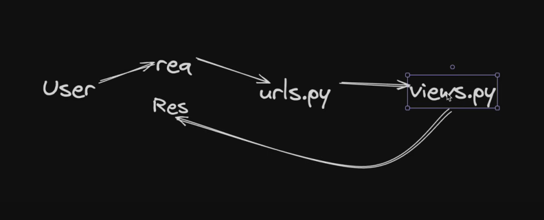

# Django Tutorial Project 

This project is a Django-based web application.

This guide provides a quick overview of Django, including project structure, folder explanations, and how to work with mini-apps and templates.

 You can either follow this README or refer to this [guide](https://docs.chaicode.com/youtube/chai-aur-django/getting-started/) for step-by-step instructions.

</br>
</br>
</br>

---
* > [Day 01 : Introduction](#day-01) 
* > [Day 02: Project Structure , Creating Views and URLs](#day-02)  
* > [Day 03: Create Mini-App and Use Jinja Templates in Django](#day-03)
* > [Day 04: Integrating Tailwind CSS with Django](#day-04)
* > [Day 05: Model and Media Setup: Handling Image Uploads in Django](#day-05)
* > [Day 06: Django Relationship Models](#day-6)
* > [Day 07: Django Forms](#day-7)
---

* > [Production Time: Quick Setup](#production-setup)

---

</br>
</br>
<a id="day-01"></a>

## 📅 Day 01: Introduction

## Prerequisites

*   Basic knowledge of Python, HTML, CSS, and JavaScript
*   Python 3.10 or later
*   uv (Install with `uv install uv`)

## Creating a Virtual Environment with uv

1.  Create a virtual environment:

    ```bash
    uv venv
    ```

2.  Activate the virtual environment:

    *   Linux/macOS and Git Bash on Windows:

        ```bash
        source .venv/bin/activate
        ```

    *   Windows:

        ```bash
        .venv\Scripts\activate
        ```

3.  Install Django:

    ```bash
    uv pip install Django
    ```

## Creating a Project

1.  Bootstrap a new Django project (this command will create a nested folder structure: `your-project-name/your-project-name`):

    ```bash
    django-admin startproject your-project-name 
    ```

2.  Change directory to the outer project folder:

    ```bash
    cd your-project-name
    ```

## Running the Development Server

1.  Start the development server:

    ```bash
    py manage.py runserver
    ```
    (You may see a warning about unapplied migrations; you can ignore this for now.)
2.  Visit `http://127.0.0.1:8000/` in your browser to see the "Congratulations!" page.

## Creating the MiniApp App

1.  Create the miniapp app:

    ```bash
    py manage.py startapp miniapp
    ```

## Write your first view

1.  Open the file `miniapp/views.py` and put the following Python code in it:

    ```python
    from django.http import HttpResponse

    def index(request):
        return HttpResponse("Hello, world. You're at the miniapp index.")
    ```

2.  To define a URLconf for the miniapp app, create a file `miniapp/urls.py` with the following content:

    ```python
    from django.urls import path

    from . import views

    urlpatterns = [
        path("", views.index, name="index"),
    ]
    ```

3.  To do this, add an import for `django.urls.include` in `your-project-name/urls.py` and insert an `include()` in the `urlpatterns` list, so you have:

    ```python
    from django.contrib import admin
    from django.urls import include, path

urlpatterns = [
        path("miniapp/", include("miniapp.urls")),
        path("admin/", admin.site.urls),
    ]
    ```

4.  Verify it’s working with the following command:

    ```bash
    py manage.py runserver
    ```

Go to `http://localhost:8000/miniapp/` in your browser, and you should see the text “Hello, world. You’re at the miniapp index.”, which you defined in the index view.


</br></br></br>

---
---
---

</br></br></br>


<a id="day-02"></a>
## 📅 Day 2: Creating Views and URLs

### 📂 Project Structure (After Day 1)

```text
your-project-name/
├── manage.py
├── your-project-name/
│   ├── __init__.py
│   ├── asgi.py
│   ├── settings.py
│   ├── urls.py
│   └── wsgi.py
├── miniapp/
│   ├── __init__.py
│   ├── admin.py
│   ├── apps.py
│   ├── models.py
│   ├── tests.py
│   ├── views.py
│   └── urls.py
└── .venv/ # created by uv venv
```

### Django Project and File Structure

This section will guide you through creating views and connecting them to URLs.

*   **views.py:** This file contains the view functions that handle requests and return responses. The name `views.py` is a convention; if you name it differently, Django won't automatically recognize it as the views module.

*   **Creating a view:** A view is a Python function that receives a request and returns a response. For example:

    ```python
    from django.http import HttpResponse

    def my_view(request):
        return HttpResponse("Hello, world!")
    ```

*   **Connecting a view to a URL:** To access a view in a browser, you need to map it to a URL in `urls.py`. For example:

    ```python
    from django.urls import path

    from . import views

    urlpatterns = [
        path("my-url/", views.my_view, name="my_view"),
    ]
    ```

    The `path()` function takes three arguments:

    *   `route`: The URL pattern to match.
    *   `view`: The view function to call.
    *   `name`: A unique name for the URL, which can be used to refer to it in templates and other parts of the code.

    The `name` property is important because it allows you to change the URL without breaking any links to it. If you don't use the `name` property, you'll have to manually update all the links whenever you change the URL.

### Project Structure (your-project-name)

*   `manage.py`: A command-line utility that lets you interact with this Django project in various ways.
*   `your-project-name/`: A directory that is the actual Python package for your project.
    *   `__init__.py`: An empty file that tells Python that this directory should be considered a Python package.
    *   `settings.py`: Settings/configuration for this Django project. Django settings will tell you all about how settings work.
    *   `urls.py`: The URL declarations for this Django project; a “table of contents” of your Django-powered site.
    *   `asgi.py`: An entry-point for ASGI-compatible web servers to serve your project.
    *   `wsgi.py`: An entry-point for WSGI-compatible web servers to serve your project.

### App Structure (miniapp)

*   `miniapp/`: This directory structure will house the miniapp application.
    *   `__init__.py`: An empty file that tells Python that this directory should be considered a Python package.
    *   `admin.py`: Files for configuration for the Django admin interface.
    *   `apps.py`: Files for configuration for the miniapp application.
    *   `migrations/`: Directory for database migrations.
        *   `__init__.py`: An empty file that tells Python that this directory should be considered a Python package.
    *   `models.py`: Files for Data models for the miniapp application.
    *   `tests.py`: Files for tests for the miniapp application.
    *   `views.py`: Files for view functions that handle requests and return responses.
    *   `urls.py`: Files for URL configurations for the miniapp application.


How Django Work Behind the scene



</br></br></br>

---
---
---

</br></br></br>

<a id="day-03"></a>
## 📅 **Day 3: Create Mini-App and Use Jinja Templates in Django**

In Django, a **mini-app** (often just called an "app") is a modular piece of your project that handles a specific feature or domain (like polls, blog, users, etc). Django encourages breaking your project into multiple apps for better **separation of concerns**, **reusability**, and **scalability**.

---

## 🎯 What Is a Mini-App in Django?

A mini-app is a Python package inside your Django project that contains its own `models.py`, `views.py`, `urls.py`, and optionally `templates/`, `static/`, etc. It helps keep your code **organized** and **modular**.

### ✅ When to Create a New App

* When a feature is **logically independent** (e.g., blog, forum, authentication).
* When it may be **reused** in other projects or parts of the project.
* When the existing app is becoming **too large** or **unmanageable**.

---

## 🛠️ Step-by-Step Guide: Create and Integrate a Mini-App

### 1️⃣ Create the App

```bash
py manage.py startapp my_mini_app
```

This will create a folder `my_mini_app` with:

```
my_mini_app/
├── admin.py
├── apps.py
├── models.py
├── views.py
├── urls.py   # (you may need to create this manually)
├── templates/
│   └── my_mini_app/
│       └── index.html
```

---

### 2️⃣ Define Views (`my_mini_app/views.py`)

```python
from django.shortcuts import render

def index(request):
    return render(request, 'my_mini_app/index.html')

def about(request):
    return render(request, 'my_mini_app/about.html')
```

---

### 3️⃣ Define URLs (`my_mini_app/urls.py`)

Create this file if it doesn’t exist.

```python
from django.urls import path
from . import views

urlpatterns = [
    path('', views.index, name='index'),
    path('about/', views.about, name='about'),
]
```

---

### 4️⃣ Connect to Main Project

#### a. Add App to `INSTALLED_APPS` in `settings.py`

```python
INSTALLED_APPS = [
    'django.contrib.admin',
    'django.contrib.auth',
    'django.contrib.contenttypes',
    'django.contrib.sessions',
    'django.contrib.messages',
    'django.contrib.staticfiles',
    'my_mini_app',  # 👈 Register the mini-app here
]
```

#### b. Include App’s URLs in Main `urls.py`

In `project/urls.py`:

```python
from django.contrib import admin
from django.urls import path, include

urlpatterns = [
    path('admin/', admin.site.urls),
    path('miniapp/', include('my_mini_app.urls')),  # 👈 Connect the mini-app
]
```

Now, visiting `http://127.0.0.1:8000/miniapp/` will show your mini-app's homepage.

---

## 📄 5️⃣ Add Jinja-style Templates

Create the HTML files inside:

```
my_mini_app/templates/my_mini_app/index.html
my_mini_app/templates/my_mini_app/about.html
```

### Example: `index.html`

```html
<!DOCTYPE html>
<html lang="en">
<head>
    <title>Mini App Home</title>
</head>
<body>
    <h1>Welcome to the Mini App!</h1>
    <p>This is the index page.</p>
</body>
</html>
```

Django by default supports its own templating language, which is very similar to Jinja (e.g., `` syntax). You can also use pure Jinja2 if you explicitly configure it, but in most Django projects, the default engine is sufficient and similar.

---

## 🚀 6️⃣ Run the Development Server

```bash
py manage.py runserver
```

Visit:

* `http://127.0.0.1:8000/miniapp/` – for index
* `http://127.0.0.1:8000/miniapp/about/` – for about page

---

## 📌 Summary

| Step | Action                                 |
| ---- | -------------------------------------- |
| 1    | `startapp my_mini_app`                 |
| 2    | Write `views.py` functions             |
| 3    | Add URLs in `urls.py`                  |
| 4    | Register app in `settings.py`          |
| 5    | Include app’s URL in project `urls.py` |
| 6    | Add templates and use them in views    |
| 7    | `runserver` and test the routes        |


</br></br></br>

---
---
---

</br></br></br>


<a id="day-04"></a>
## 📅 Day 4: Integrating Tailwind CSS with Django (Enhanced with Node/NPM Support)

Tailwind CSS is a utility-first CSS framework for rapidly building custom user interfaces. Here’s how to integrate it into your Django project **with support for npm and automatic setup**.


* A check for Node.js before installing Tailwind dependencies.
* Automatic setting of the `TAILWIND_CSS_BIN` path in `settings.py` if necessary.
* A fallback for users who do not have Node.js installed.
* Clear instructions for `uv` virtual environments.

---

### 🔧 Step 1: Install Required Packages

First, install `django-tailwind`:

```bash
uv pip install 'django-tailwind[reload]'
```

> ⚠️ If `uv` doesn't work (e.g., says "audited 1" but nothing installs), fallback to regular pip:

```bash
python -m pip install --upgrade pip
pip install 'django-tailwind[reload]'
```

> ✅ Make sure you're inside a **`.venv`** or **`.uv`** virtual environment before installing!

---

### 🛠️ Step 2: Check Node.js & Install Dependencies

Before continuing, make sure Node.js is installed:

```bash
node -v
npm -v
```

If not installed, download it from: [https://nodejs.org/](https://nodejs.org/)

**💡 Linux Quick Install:**

```bash
sudo apt install nodejs npm -y
```

> ✅ You *must* have Node.js for Tailwind CSS to compile!

---

### 🧱 Step 3: Create and Configure Theme App

Create the Tailwind app:

```bash
python manage.py tailwind init theme
```

Then in your `settings.py`:

```python
INSTALLED_APPS = [
    ...
    'tailwind',
    'theme',
    ...
]

TAILWIND_APP_NAME = 'theme'
INTERNAL_IPS = ['127.0.0.1']
```

---

### 🔧 Step 4: Set NPM Binary Path (Optional but Recommended)
if you face this Error during tailwind CSS installation command :
    
        CommandError:
        It looks like node.js and/or npm is not installed or cannot be found.

        Visit <https://nodejs.org> to download and install node.js for your system.

        If you have npm installed and still getting this error message, set NPM_BIN_PATH variable in settings.py to match path of NPM executable in your system.

        Example:
        NPM_BIN_PATH = "/usr/local/bin/npm"
    

🚩 You have to download [Nodejs](https://nodejs.org/en/download) and install it on your device 


If you have Node.js but `tailwind install` fails, you may need to set the full npm binary path:

Find the npm path:

```bash
which npm
```

Then add this to `settings.py`:

```python
import os
NPM_BIN_PATH = os.getenv("NPM_BIN_PATH", "/usr/bin/npm")  # Update this if different
```

You can also set it manually like this:

```python
NPM_BIN_PATH = "/usr/bin/npm"  # Linux
# NPM_BIN_PATH = "C:/Program Files/nodejs/npm.cmd"  # Windows
```

This helps Django find the `npm` binary when building assets.

---

### 📦 Step 5: Install Tailwind CSS Dependencies

Now install the Tailwind CSS dependencies:

```bash
python manage.py tailwind install
```

This will install packages like `tailwindcss`, `autoprefixer`, and `postcss`.

---


### ✅ **Step-by-Step Template Setup**

#### 1. **At the Top of `base.html` (Template File)**

Load the required Tailwind template tags:

```django

```

✅ This line enables Django to use Tailwind-related template tags.

---

#### 2. **Inside `<head>` Tag (Usually at the top of HTML)**

Insert the Tailwind CSS stylesheet link:

```django

```

✅ This line injects the compiled Tailwind CSS into your HTML.

---

### 🔧 Example `base.html` (Basic Setup)

```html

<!DOCTYPE html>
<html lang="en">
<head>
    <meta charset="UTF-8">
    <title>My Site</title>
    
</head>
<body>
    
    <!-- Your content here -->
    
</body>
</html>
```


Now you can use Tailwind utility classes in your HTML:

```html
<h1 class="text-3xl font-bold text-blue-600">Hello, Tailwind!</h1>
```

---

Absolutely! Here's the revised section of your guide that replaces **Step 8** and clarifies the usage of the Tailwind dev server vs. production build — ideal for a `README.md`:

---

### 🧪 Step 8: Run Tailwind CSS Compiler (Development Only)

During **development**, open a **new integrated terminal** (you can name it `tailwind`) and start the Tailwind compiler:

```bash
python manage.py tailwind start
```

This watches your templates and CSS files for changes and **automatically recompiles your Tailwind CSS** with hot-reload support.

> ✅ Keep this terminal running in the background while developing your frontend!

---

### 🚀 Production Setup: Compile Once, No Extra Terminal Needed

When you're ready to deploy or no longer need hot-reload:

1. Run the Tailwind build command:

   ```bash
   python manage.py tailwind build
   ```

2. Then collect static files:

   ```bash
   python manage.py collectstatic
   ```

3. Now Django will serve the final, compiled Tailwind CSS without needing a separate terminal or `tailwind start`.

> ⚠️ **Important:** Never use `tailwind start` in production — it's only for development.

---

### ✅ Summary

| Environment     | Command                           | Purpose                         |
| --------------- | --------------------------------- | ------------------------------- |
| Development     | `python manage.py tailwind start` | Live-reloading CSS compiler     |
| Production      | `python manage.py tailwind build` | One-time CSS compilation        |
| Production step | `python manage.py collectstatic`  | Gathers static files for Django |


---

## 🧠 Why Use `django-tailwind`?

* **Live reload support**: Tailwind styles update in real-time.
* **Isolation**: Keeps Tailwind config separate from your backend logic.
* **Cleaner organization**: Your custom CSS and JS live inside the theme app.

---

## 🧭 When Should You Use a Separate Tailwind App?

You should create a separate app like `theme` when:

* You want to **modularize your front-end styling**.
* You're building a **custom UI** that heavily uses Tailwind classes.
* You're working with a **team** that handles frontend and backend separately.
* You plan to integrate **Alpine.js, Flowbite, or other Tailwind plugins**.

---


### **🔥 Tailwind Hot Reload Integration**


✅ **Why Use Auto Reloading?**

During development, tools like `django-browser-reload` automatically refresh the browser when you change Tailwind CSS or templates. This speeds up your workflow and saves you from manual reloading.

---


🛠 **2. Update `INSTALLED_APPS`**

```python
INSTALLED_APPS = [
    ...
    "django_browser_reload",
]
```

⚙️ **3. Update `MIDDLEWARE`**

```python
MIDDLEWARE = [
    ...
    "django_browser_reload.middleware.BrowserReloadMiddleware",
]
```

🌐 **4. Add URL pattern**

```python
from django.urls import path, include

urlpatterns = [
    ...
    path("__reload__/", include("django_browser_reload.urls")),
]
```


---

## ✅ Conclusion

By integrating Tailwind CSS with Django using `django-tailwind`, you get a powerful frontend setup that stays clean, efficient, and highly customizable. Your styling is now organized, hot-reloaded, and ready for production.

</br>

---
<center>Break For 5 minutes</center>

---
</br>

Here's a clear explanation of the terminal messages, what the warning means, and how to fix it — including applying migrations and setting up the Django admin:

---

## ⚠️ **Fixing: “Unapplied Migrations” Warning**

You're seeing this message:

> `You have 18 unapplied migration(s)... Your project may not work properly...`

This means Django has changes in its internal apps (`auth`, `admin`, `sessions`, etc.) that haven't been applied to your database yet.

---

### ✅ **Fix Step 1: Apply Migrations**

Run this command in your terminal:

```bash
python manage.py migrate
```

This will apply all pending migrations and set up the database tables properly.

---

### ✅ **Fix Step 2: Create Superuser for Admin Panel**

If you want access to Django’s admin panel, create a superuser:

```bash
python manage.py createsuperuser
```

It will prompt you for:

* Username
* Email
* Password

Once created, you can log in at:

```
http://127.0.0.1:8000/admin/
```

---

### 🧪 Development Notes

* This message is **normal** during development and not an error.
* You only need to run `migrate` once (or when models change).
* The warning:

  > `WARNING: This is a development server. Do not use it in a production setting.`

  just reminds you **not to use `runserver` in production**. Use **Gunicorn**, **uWSGI**, or **Daphne** for deployment instead.


---

### ✅ **Fix Step 3: Reset User Password (Admin CLI)**

If you forgot your admin password or want to reset any user's password via the terminal, use:

```bash
python manage.py changepassword <username>
```

For example:

```bash
python manage.py changepassword admin
```

It will prompt you to enter a new password securely.

---

> 💡 If you don’t remember the username, you can check it in the database (e.g., via SQLite browser) or log in to the Django shell:


 ```bash
 python manage.py shell
 ```

 ```python
 from django.contrib.auth.models import User
 User.objects.all()
 ```


</br></br></br>

---
---
---
</br></br></br>


<a id="day-05"></a>

## Day 5: 📅 Model and Media Setup: Handling Image Uploads in Django

This guide helps you configure your Django project to upload and serve media files (e.g., images) during **development**.

---

### ⚠️ Best Practice Reminder

> 🛑 **Never create models inside your main project folder.**
> ✅ Always create models inside a Django **app** (like `miniapp/models.py`).
>
> 🧱 This keeps your codebase modular, reusable, and maintainable — a widely followed **industry standard**.

---

### ✅ Step 1: Install Pillow

Django uses the Pillow library to handle image files.

```bash
uv pip install Pillow
```

---

### ✅ Step 2: Create Model in App (`miniapp/models.py`)

```python
from django.db import models
from django.utils import timezone

class AppVariety(models.Model):
    name = models.CharField(max_length=100)
    image = models.ImageField(upload_to="mini_apps/")
    app_type = models.CharField(
        max_length=2,
        choices=[
            ("FR", "Fresh App"),
            ("SO", "Somosa App"),
            ("JR", "Senior App"),
            ("SR", "Senior App"),
        ("GR", "Graduate App"),
        ],
    )
    date_added = models.DateTimeField(default=timezone.now)

    def __str__(self):
        return self.name  # This controls how the model appears in Django admin
```

---

### ✅ Step 3: Configure `settings.py` for Media

```python
MEDIA_URL = "/media/"
MEDIA_ROOT = BASE_DIR / "media"
```

---

### ✅ Step 4: Serve Media Files in Development

Add this in your main `urls.py` file:

```python
from django.conf import settings
from django.conf.urls.static import static

urlpatterns = [
    path("admin/", admin.site.urls),
    path("", views.home, name="home"),
    path("about/", views.about, name="about"),
    path("contact/", views.contact, name="contact"),
    path("miniapp/", include("miniapp.urls")),
]

if settings.DEBUG:
    urlpatterns += static(settings.MEDIA_URL, document_root=settings.MEDIA_ROOT)
```


---


### ✅ Step 5: Migrate the Database


```bash
python manage.py makemigrations
python manage.py migrate
```

---

### 💡 Why This Step Matters

* `makemigrations`: Tells Django to generate migration files based on the changes in your models.
* `migrate`: Applies those migration files to create or update the actual database tables.

---

### ✅ Best Practice

Always specify the app name when generating migrations for a specific app:

```bash
python manage.py makemigrations your_app_name
```

This keeps your migrations organized, avoids confusion, and speeds up the process by only targeting the app that was updated.

---


### ✅ Step 6: Use Admin Panel to Upload

1. Create a superuser if you still not created a super user:

   ```bash
   python manage.py createsuperuser
   ```

2. Register model in `miniapp/admin.py`:

   ```python
   from django.contrib import admin
   from .models import AppVariety

   admin.site.register(AppVariety)
   ```

3. Run:

   ```bash
   python manage.py runserver
   ```

4. Upload an image via `http://127.0.0.1:8000/admin/`.

---

### ✅ Step 7: Show Image in Template

In your view:

```python
def home(request):
    apps = AppVariety.objects.all()
    return render(request, "home.html", {"apps": apps})
```

In your HTML (`home.html`):

```django

<!DOCTYPE html>
<html>
<head>...</head>
<body>
    
        
    
</body>
</html>
```

---

### 📌 Final Example

Uploaded to: `media/mini_apps/logo.png`
Accessible at: `http://127.0.0.1:8000/media/mini_apps/logo.png`

---


## 📦 Step 8: Retrieve and Display Model Data (Views, Templates, Admin)

---

### 🧠 1. What You've Already Done: The Model

You've defined the model `AppVariety` in `models.py`:

```python
class AppVariety(models.Model):
    name = models.CharField(max_length=100)
    image = models.ImageField(upload_to="mini_apps/")
    app_type = models.CharField(
        max_length=2,
        choices=[
            ("FR", "Fresh App"),
            ("SO", "Somosa App"),
            ("JR", "Senior App"),
        ("SR", "Senior App"),
        ("GR", "Graduate App"),
        ],
    )
    date_added = models.DateTimeField(default=timezone.now)

    def __str__(self):
        return self.name  # This controls how the model appears in Django admin
```

✅ `__str__` is optional but **recommended** — it defines how objects are labeled in the admin and querysets.

---

### 🧩 2. Show Data in Views (`views.py`)

To fetch all entries of `AppVariety` and pass them to a template:

```python
from django.shortcuts import render
from .models import AppVariety

def home(request):
    apps = AppVariety.objects.all()
    return render(request, 'miniapp/all_mini_app.html', {'apps': apps})
```

✅ `AppVariety.objects.all()` gets all rows from the database.

---

### 🖼 3. Show Data in HTML (Template)

In your template (e.g., `miniapp/home.html`):

```html
<h2>Mini App List</h2>

<ul>
  
    <li>
      <strong>{{ app.name }}</strong><br>
      Type: {{ app.get_app_type_display }}<br>
      <br>
      Date Added: {{ app.date_added|date:"Y-m-d" }}
    </li>
  
    <li>No apps found.</li>
  
</ul>
```

✅ Use `get_app_type_display` to show human-readable choice text (e.g., "Fresh App" instead of `"FR"`).

✅ Always use `{{ app.image.url }}` to show the image from `ImageField`.

---

### ⚙️ 4. Customize Django Admin

Register the model in `admin.py` and customize the list display:

```python
from django.contrib import admin
from .models import AppVariety

@admin.register(AppVariety)
class AppVarietyAdmin(admin.ModelAdmin):
    list_display = ('name', 'app_type', 'date_added')
    list_filter = ('app_type',)
    search_fields = ('name',)
```

✅ This will:

* Show selected fields in the admin list view.
* Add a filter sidebar by app type.
* Allow search by name.

---

### 🧪 Example Summary

| Task                  | Code / Usage                                   |
| --------------------- | ---------------------------------------------- |
| Fetch from DB         | `AppVariety.objects.all()`                     |
| Render in view        | `render(request, 'template.html', context)`    |
| Loop in template      | ` ... `       |
| Human-readable choice | `{{ app.get_app_type_display }}`               |
| Image rendering       | `{{ app.image.url }}`                          |
| Admin customization   | `list_display`, `list_filter`, `search_fields` |

---

## 🚀 Navigation and Routing

### 1. URL Configuration

Django uses `urls.py` files to map URL patterns to view functions. Each app can have its own `urls.py`, and the main project's `urls.py` includes these app-specific URL configurations.

#### Example: Project's `urls.py`

```python
from django.contrib import admin
from django.urls import include, path

urlpatterns = [
    path('admin/', admin.site.urls),
    path('miniapp/', include('miniapp.urls')),
    path('website/', include('website.urls')),
    path('contact/', views.contact, name='contact'),  # Direct access to contact view
]
```

#### Example: App's `urls.py` (miniapp)

```python
from django.urls import path
from . import views

urlpatterns = [
    path('', views.all_mini_app, name='all_mini_app'),
    path('<int:app_id>/', views.app_details, name='app_details'),
]
```

### 2. Creating Views

Views are Python functions that handle requests and return responses. They often render templates with data from the backend.

#### Example: `views.py`

```python
from django.shortcuts import render, get_object_or_404
from .models import AppVariety

def all_mini_app(request):
    apps = AppVariety.objects.all()
    return render(request, 'miniapp/all_mini_app.html', {'apps': apps})

def app_details(request, app_id):
    app = get_object_or_404(AppVariety, pk=app_id)
    return render(request, 'miniapp/app_details.html', {'apps': apps})
```

### 3. Displaying Backend Data in Templates

Use Django's template language to display data passed from views.

#### Example: `all_mini_app.html`

```html
<h2>All Mini Apps</h2>
<ul>
    
    <li>
        <a href="">{{ app.name }}</a>
    </li>
    
</ul>
```

#### Example: `app_details.html`

```html
<h2>App Details</h2>
<h3>{{ app.name }}</h3>

<p>Type: {{ app.get_app_type_display }}</p>
<p>Date Added: {{ app.date_added }}</p>
<a href="">Back to App List</a>
```

### 4. Handling Navigation with Route Path Names

Use the `` template tag to generate URLs based on the names defined in `urls.py`. The namespace is the name of the app. This makes your URLs more maintainable.

#### Namespaces Explained

*   **Why use namespaces?** Namespaces prevent URL name collisions between different apps. If two apps have a URL pattern named `'index'`, Django needs a way to distinguish between them.
*   **App Namespaces:** By including `app_name = 'miniapp'` in your app's `urls.py`, you create a namespace for that app's URLs.

#### Example: Linking to App Details

```html
<a href="">View Details</a>
```

In this example, `miniapp` is the namespace and `app_details` is the name of the URL pattern defined in `miniapp/urls.py`, and `app.id


</br></br></br>

---
---
---
</br></br></br>


<a id="day-6"></a>

## 📅 Day 6: Django Relationship Models

Relational databases like the one Django uses (typically SQLite/PostgreSQL/MySQL) thrive on relationships between tables. Django models map directly to these tables, and you can define **relationships** between models using `ForeignKey`, `OneToOneField`, and `ManyToManyField`.

---

### 📘 1. One-to-Many Relationship

In this project, `AppReview` has a one-to-many relationship with `AppVariety`. This means that one `AppVariety` can have multiple `AppReview` entries.

```python
class AppReview(models.Model):
    app = models.ForeignKey(
        AppVariety,
        on_delete=models.CASCADE,
        related_name="reviews",
        verbose_name="App Variety",
    )
    user = models.ForeignKey(User, on_delete=models.CASCADE)
    review_text = models.TextField(default="")
    rating = models.PositiveIntegerField(default=0)
    date_added = models.DateTimeField(default=timezone.now)

    def __str__(self):
        return f"{self.user.username} - {self.app.name}"
```

*   `app = models.ForeignKey(...)`: Defines the foreign key relationship.
*   `on_delete=models.CASCADE`: Specifies that if an `AppVariety` is deleted, all related `AppReview` entries will also be deleted.
*   `related_name="reviews"`: Allows you to access the reviews for an `AppVariety` instance using `app_variety.reviews.all()`.

---

### 📙 2. Many-to-Many Relationship

In this project, `AppStore` has a many-to-many relationship with `AppVariety`. This means that one `AppStore` can offer multiple `AppVariety` entries, and one `AppVariety` can be offered by multiple `AppStore` entries.

```python
class AppStore(models.Model):
    name = models.CharField(max_length=100)
    mother_company = models.CharField(max_length=255)
    app_varieties = models.ManyToManyField(AppVariety, related_name="stores")
    contact_number = models.CharField(max_length=15, blank=True, null=True)
    email = models.EmailField(blank=True, null=True)

    def __str__(self):
        return self.name + " store of " + self.mother_company
```

*   `app_varieties = models.ManyToManyField(...)`: Defines the many-to-many relationship.
*   `related_name="stores"`: Allows you to access the stores for an `AppVariety` instance using `app_variety.stores.all()`.

---

### 📗 3. One-to-One Relationship

In this project, `AppCertificates` has a one-to-one relationship with `AppVariety`. This means that one `AppVariety` can have only one `AppCertificates` entry, and vice versa.

```python
class AppCertificates(models.Model):
    app = models.OneToOneField(
        AppVariety,
        on_delete=models.CASCADE,
        related_name="certificates",
        verbose_name="App Name",
    )
    certificate_name = models.CharField(max_length=255)
    certificate_number = models.CharField(max_length=100, unique=True)
    issued_by = models.CharField(max_length=255)
    issue_date = models.DateTimeField(default=timezone.now)
    expiry_date = models.DateField(blank=True, null=True)

    def __str__(self):
        return f"{self.certificate_name} for {self.app.name}"
```

*   `app = models.OneToOneField(...)`: Defines the one-to-one relationship.
*   `on_delete=models.CASCADE`: Specifies that if an `AppVariety` is deleted, the related `AppCertificates` entry will also be deleted.
*   `related_name="certificates"`: Allows you to access the certificate for an `AppVariety` instance using `app_variety.certificates`.

---

### 🛠 Best Practices

| Practice                        | Why It Matters                                  |
| ------------------------------- | ----------------------------------------------- |
| Keep models in separate apps    | Makes code modular and reusable                 |
| Add `__str__` method            | Improves admin readability                      |
| Use related\_name in ForeignKey | Avoids naming conflicts, improves reverse query |
| Normalize data with relations   | Saves space, enforces integrity                 |

---

### 🧪 Customize Admin Interface

```python
from django.contrib import admin
from .models import AppVariety, AppReview, AppStore, AppCertificates

class AppReviewInline(admin.TabularInline):
    model = AppReview
    extra = 1

class AppVarietyAdmin(admin.ModelAdmin):
    list_display= ('name', 'app_type', 'date_added', 'is_active', 'price')
    inlines= [AppReviewInline]

class AppStoreAdmin(admin.ModelAdmin):
    list_display = ('name', 'mother_company', 'contact_number', 'email')
    filter_horizontal = ['app_varieties']


class AppCertificateAdmin(admin.ModelAdmin):
    list_display= ('app','certificate_name','certificate_number','issued_by','issue_date','expiry_date')

admin.site.register(AppVariety, AppVarietyAdmin)
# admin.site.register(AppReview, AppReviewInline)
admin.site.register(AppStore, AppStoreAdmin)
admin.site.register(AppCertificates, AppCertificateAdmin)
```

*   `AppReviewInline`: Defines an inline admin interface for AppReview, allowing you to create, edit, and delete reviews directly from the AppVariety admin page.
*   `AppVarietyAdmin`:
    *   `list_display`: Specifies the fields to be displayed in the AppVariety list view in the admin.
    *   `inlines`: Includes the AppReviewInline, allowing you to manage reviews directly from the AppVariety admin page.
*   `AppStoreAdmin`:
    *   `list_display`: Specifies the fields to be displayed in the AppStore list view.
    *   `filter_horizontal`: Uses a horizontal filter for the app_varieties ManyToManyField, making it easier to select multiple app varieties for an app store.
*   `AppCertificateAdmin`:
    *   `list_display`: Specifies the fields to be displayed in the AppCertificates list view.

---

### � Migration Reminder

After modifying models:

```bash
python manage.py makemigrations miniapp
python manage.py migrate
```


</br></br></br>

---
---
---
</br></br></br>

<a id="day-7"></a>

## 📅 Day 7: Django Forms (Beginner to Advanced)

Django's forms framework is a powerful system that automates the tedious work of creating HTML forms, validating user input, and processing data. It acts as a secure bridge between your front-end templates and your back-end logic.

### Why Use Django Forms?

* **Security:** Provides automatic protection against common vulnerabilities like Cross-Site Request Forgery (CSRF).
* **Validation:** Offers a centralized and reusable way to validate data before it hits your database.
* **Rendering:** Quickly generates HTML form elements, which you can easily customize.
* **Organization:** Separates form-handling logic from your views, leading to cleaner and more maintainable code.

---

### Two Main Types of Forms

| Form Type           | Use Case                                                                | Example                               |
| ------------------- | ----------------------------------------------------------------------- | ------------------------------------- |
| `forms.Form`        | For forms not directly linked to a database model.                      | Contact form, search form, login form |
| `forms.ModelForm`   | For forms that directly create or update an instance of a database model. | Creating a blog post, editing a user profile, **submitting an app review**. |

---

### Part 1: The Basics with `forms.Form`

Let's create a simple contact form. This form won't save to the database, but it will validate input and could be used to send an email.

#### 1. Create `forms.py`

In one of your apps (e.g., a `website` app if you have one, or `miniapp` for this example), create a `forms.py` file:

**`miniapp/forms.py`**

```python
from django import forms

class ContactForm(forms.Form):
    name = forms.CharField(max_length=100, required=True)
    email = forms.EmailField(required=True)
    message = forms.CharField(widget=forms.Textarea, required=True)
```

#### 2. Create the View

In `miniapp/views.py`, create a view to handle the form:

```python
from django.shortcuts import render, redirect
from .forms import ContactForm
from django.core.mail import send_mail # Example action

def contact_view(request):
    if request.method == 'POST':
        form = ContactForm(request.POST)
        if form.is_valid():
            # Process the data in form.cleaned_data
            name = form.cleaned_data['name']
            email = form.cleaned_data['email']
            message = form.cleaned_data['message']
            
            # Example action: send an email
            # send_mail(
            #     f"Message from {name}",
            #     message,
            #     email,
            #     ['admin@example.com'], # Your admin email
            # )
            
            return redirect('home') # Redirect after successful submission
    else:
        form = ContactForm() # An unbound form for a GET request

    return render(request, 'miniapp/contact.html', {'form': form})
```

#### 3. Create the Template

In `miniapp/templates/miniapp/contact.html`, render the form:

```html



<div class="max-w-lg mx-auto mt-10 p-6 bg-white rounded-lg shadow-md">
    <h1 class="text-2xl font-bold mb-6">Contact Us</h1>
    <form method="post">
         <!-- Essential for security! -->
        
        <!-- Render form fields with Tailwind CSS classes -->
        <div class="mb-4">
            <label for="{{ form.name.id_for_label }}" class="block text-gray-700 text-sm font-bold mb-2">Name:</label>
            {{ form.name }}
            {{ form.name.errors }}
        </div>

        <div class="mb-4">
            <label for="{{ form.email.id_for_label }}" class="block text-gray-700 text-sm font-bold mb-2">Email:</label>
            {{ form.email }}
            {{ form.email.errors }}
        </div>

        <div class="mb-6">
            <label for="{{ form.message.id_for_label }}" class="block text-gray-700 text-sm font-bold mb-2">Message:</label>
            {{ form.message }}
            {{ form.message.errors }}
        </div>

        <button type="submit" class="bg-blue-500 hover:bg-blue-700 text-white font-bold py-2 px-4 rounded">
            Submit
        </button>
    </form>
</div>

```

> **Rendering Tip:** While `{{ form.as_p }}` is fast, manual rendering (as shown above) gives you full control over styling with frameworks like Tailwind CSS.

---

### Part 2: Power Up with `ModelForm`

`ModelForm` is a real time-saver. Let's create a form for users to submit an `AppReview` for a specific `AppVariety`.

#### 1. Create the `ModelForm`

In `miniapp/forms.py`, add the `AppReviewForm`:

```python
# miniapp/forms.py
from django import forms
from .models import AppReview

# ... your ContactForm ...

class AppReviewForm(forms.ModelForm):
    class Meta:
        model = AppReview
        fields = ['rating', 'review_text'] # Fields the user will fill out
        widgets = {
            'rating': forms.NumberInput(attrs={
                'class': 'w-full px-3 py-2 border rounded',
                'min': 1,
                'max': 5
            }),
            'review_text': forms.Textarea(attrs={
                'class': 'w-full px-3 py-2 border rounded',
                'rows': 4,
                'placeholder': 'Write your review here...'
            }),
        }
```

* `class Meta`: Tells the form which model to use.
* `fields`: A list of field names from the model to include in the form.
* `widgets`: An optional dictionary to customize the HTML input element for a field. This is perfect for adding CSS classes!

#### 2. Update the View

Modify your `app_details` view in `miniapp/views.py` to handle the form submission.

```python
from django.shortcuts import render, get_object_or_404, redirect
from .models import AppVariety
from .forms import AppReviewForm
from django.contrib.auth.decorators import login_required

# ... other views ...

@login_required # Protect this view so only logged-in users can review
def app_details(request, app_id):
    app = get_object_or_404(AppVariety, pk=app_id)
    form = AppReviewForm() # Initialize the form

    if request.method == 'POST':
        form = AppReviewForm(request.POST)
        if form.is_valid():
            # Don't save to DB yet, we need to add the user and app
            review = form.save(commit=False)
            review.app = app
            review.user = request.user
            review.save() # Now save to the database
            return redirect('miniapp:app_details', app_id=app.id)
    
    # Get all reviews for this app to display them
    reviews = app.reviews.all()
    
    return render(request, 'miniapp/app_details.html', {
        'app': app,
        'reviews': reviews,
        'form': form
    })
```

* `@login_required`: A decorator that automatically redirects non-logged-in users to the login page.
* `form.save(commit=False)`: This is crucial. It creates a model instance from the form data but **doesn't** save it to the database yet. This allows us to add data the user didn't submit, like the `app` and `user`.

#### 3. Update the Template

Now, add the form and display existing reviews in `miniapp/templates/miniapp/app_details.html`.

```html



<div class="container mx-auto p-4">
    <!-- App Details -->
    <h2 class="text-3xl font-bold">{{ app.name }}</h2>
    
    <p>Type: {{ app.get_app_type_display }}</p>
    
    <hr class="my-6">

    <!-- Review Submission Form -->
    <h3 class="text-2xl font-semibold mb-4">Leave a Review</h3>
    
        <form method="post" class="bg-gray-100 p-4 rounded-lg">
            
            {{ form.as_p }}
            <button type="submit" class="mt-4 bg-green-500 text-white font-bold py-2 px-4 rounded">Submit Review</button>
        </form>
    
        <p>You must be <a href="" class="text-blue-600 hover:underline">logged in</a> to leave a review.</p>
    

    <hr class="my-6">

    <!-- Existing Reviews -->
    <h3 class="text-2xl font-semibold mb-4">Reviews</h3>
    
        <div class="bg-white p-4 rounded-lg shadow mb-4">
            <p class="font-bold">{{ review.user.username }} - Rating: {{ review.rating }}/5</p>
            <p class="text-gray-700">{{ review.review_text }}</p>
            <p class="text-sm text-gray-500 mt-2">{{ review.date_added|date:"F j, Y" }}</p>
        </div>
    
        <p>No reviews yet. Be the first!</p>
    
</div>

```

---

### Part 3: Advanced Concepts

#### Custom Validation

You can add custom validation logic to your forms.

**Example: Ensure a review rating is between 1 and 5.**
While our `NumberInput` widget sets `min` and `max` on the front-end, we should always validate on the back-end too.

In `miniapp/forms.py`, modify `AppReviewForm`:

```python
class AppReviewForm(forms.ModelForm):
    # ... Meta class and widgets ...

    def clean_rating(self):
        rating = self.cleaned_data['rating']
        if rating < 1 or rating > 5:
            raise forms.ValidationError("Rating must be between 1 and 5.")
        return rating
```

Django automatically calls any method named `clean_<fieldname>()` during the `is_valid()` check.

#### The `ModelChoiceField`

The initial user prompt included this form. Let's break it down.

```python
from django import forms
from .models import AppVariety

class AppVarietiesForm(forms.Form):
    app_variety = forms.ModelChoiceField(
        queryset=AppVariety.objects.all(),
        label="Select an App Variety",
        empty_label="-- Select One --"
    )
```

* `ModelChoiceField`: Creates a dropdown select input (`<select>`).
* `queryset`: The database query that populates the dropdown options. In this case, it's all `AppVariety` objects.
* This is perfect for pages where a user needs to select a model instance from a list, such as associating a product with a category on an admin page.


</br>
</br>
</br>
</br>
</br>
</br>

---
---
---

</br>
</br>
</br>

<a id="production-setup"></a>

# 🐍 Django Professional Project Quick Setup (README Guide)

This is a quick and professional way to set up a Django project using virtual environment, static/media handling, and template structure.

---

## 🚀 Step-by-Step Setup

### 1. Create Virtual Environment

```bash
python -m venv .venv
```

* Activtion

  * for >> Linux/macOS/Git Bash Terminal (windows)

    ```
    source .venv/bin/activate        
    ```

  * for >> # Windows

        ```
        .venv\Scripts\activate          
        ```

### 2. Install Django

```bash
pip install django
```

### 3. Save Requirements

```bash
pip freeze > requirements.txt
```

### 4. Create Django Project

```bash
django-admin startproject myproject .
```

### 5. Create Your First App

An "app" in Django is a self-contained module for a specific functionality (e.g., a blog, a user authentication system).

```bash
python manage.py startapp website
```

### 6. Run Initial Migrations & Create Superuser

```bash
python manage.py migrate
python manage.py createsuperuser
```

---

## 📁 Create Folders (Cross-Platform)

### For macOS/Linux

```bash
mkdir static media templates templates/website
```

### For Windows

```cmd
mkdir static && mkdir media && mkdir templates && mkdir templates\website
```

---

## 🗄 Folder Structure (Recommended)

```
project_root/
├── .venv/
├── myproject
|   ├── static/
│   ├── media/
│   ├── templates/
│   │   ├── layout.html      # Our new base layout
│   │   └── website/         # app-level template folder
│   │       └── index.html   # Our new child template
│   ├── myproject/           # settings.py lives here
│   ├── website/             # Our new Django app
│   ├── manage.py
└── requirements.txt
```

---

## ⚙️ settings.py Configuration

### Add Your App to INSTALLED_APPS

In `myproject/settings.py`, add your new `website` app to the `INSTALLED_APPS` list.

```python
INSTALLED_APPS = [
    'django.contrib.admin',
    'django.contrib.auth',
    'django.contrib.contenttypes',
    'django.contrib.sessions',
    'django.contrib.messages',
    'django.contrib.staticfiles',
    'website',  # ➤ Add this line
]
```

### Static and Media Settings

```python
import os

STATIC_URL = '/static/'
STATICFILES_DIRS = [os.path.join(BASE_DIR, 'static')]

MEDIA_URL = '/media/'
MEDIA_ROOT = os.path.join(BASE_DIR, 'media')
```

### Templates Settings

```python
TEMPLATES = [
    {
        'BACKEND': 'django.template.backends.django.DjangoTemplates',
        # ➤ Highlight: Tell Django to look in the project-level 'templates' folder
        'DIRS': [os.path.join(BASE_DIR, 'templates')],
        'APP_DIRS': True,
        'OPTIONS': {
            'context_processors': [
                'django.template.context_processors.debug',
                'django.template.context_processors.request',
                'django.contrib.auth.context_processors.auth',
                'django.contrib.messages.context_processors.messages',
            ],
        },
    },
]
```

---

## 📝 Creating a Base Layout & Using Template Inheritance

Template inheritance allows you to build a base "skeleton" template that contains all the common elements of your site and defines **blocks** that child templates can override.

#### 1. Create Base Layout (`templates/layout.html`)

This is your main skeleton file.

```html

<!DOCTYPE html>
<html lang="en">
<head>
    <meta charset="UTF-8">
    <meta name="viewport" content="width=device-width, initial-scale=1.0">
    <!-- The title block can be changed by child templates -->
    <title>My Awesome Site</title>
    <!-- Example of linking a static CSS file -->
    {# <link rel="stylesheet" href=""> #}
</head>
<body>
    <header>
        <nav>
            <a href="/">Home</a>
            <a href="/admin/">Admin</a>
        </nav>
    </header>

    <main>
        <!-- The content block is where child template content will go -->
        
        
    </main>

    <footer>
        <p>&copy; 2024 My Project</p>
    </footer>
</body>
</html>
```

#### 2. Create a Child Template (`templates/website/index.html`)

This template `extends` the base layout and fills in the blocks.

```html



    Home Page - Welcome!



    <h1>Welcome to the Home Page!</h1>
    <p>This content is from the <strong>index.html</strong> template, but the header and footer are from <strong>layout.html</strong>.</p>

```

---

## 🔌 Wiring Up the View and URL

Now, let's create a view to render our `index.html` template and a URL to access it.

#### 1. Create a View (`website/views.py`)

Open `website/views.py` and add the following function:

```python
from django.shortcuts import render

def index(request):
    """A view to render the home page."""
    return render(request, 'website/index.html')
```

#### 2. Create App-Level URLs (`website/urls.py`)

Create a **new file** inside your `website` app folder named `urls.py`:

```python
# website/urls.py
from django.urls import path
from . import views

urlpatterns = [
    path('', views.index, name='home'),
]
```

#### 3. Include App URLs in Project (`myproject/urls.py`)

Finally, tell your main project's `urls.py` file to include the URLs from the `website` app.

```python
from django.contrib import admin
from django.urls import path, include  # Make sure 'include' is imported
from django.conf import settings
from django.conf.urls.static import static

urlpatterns = [
    path('admin/', admin.site.urls),
    path('', include('website.urls')),  # ➤ Include your app's URLs
]

# This is for serving media files during development
if settings.DEBUG:
    urlpatterns += static(settings.MEDIA_URL, document_root=settings.MEDIA_ROOT)
```

---

## 🧪 Run the Server

```bash
python manage.py runserver
```

Visit: [http://127.0.0.1:8000/](http://127.0.0.1:8000/)

---

✅ You now have a professional Django setup with a working home page that uses template inheritance
